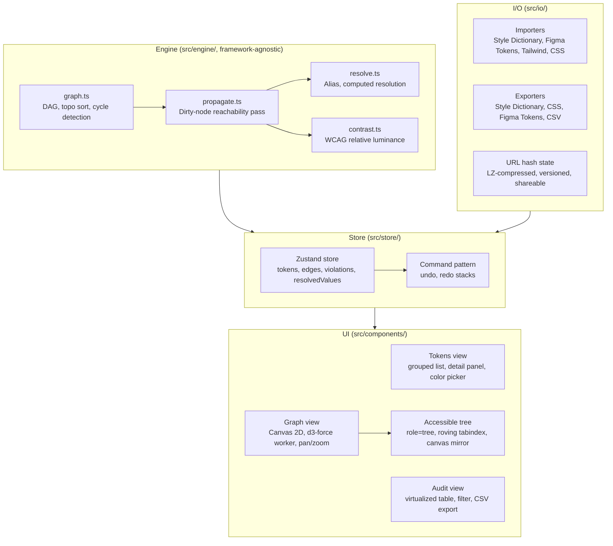

# Cascade

A browser-based design token editor that models your token system as a dependency graph. When you change a base color, Cascade recomputes every downstream WCAG contrast relationship in real time and surfaces every violation the moment it occurs, before a pull request or an accessibility audit has a chance to catch it.

## The problem

A designer adjusts a brand hue during a rebrand. Somewhere downstream, `--text-on-primary` drops below a 4.5:1 contrast ratio and silently fails WCAG AA. `--focus-ring` becomes invisible on dark surfaces. `--link-default` is now unreadable on white backgrounds. None of this is visible until QA, a user complaint, or a formal accessibility audit, all of which are expensive and late.

The root cause is that no standard tool treats design tokens as a dependency graph. When a base color changes, every semantic alias derived from it needs re-evaluating, and every contrast pair that uses those aliases needs retesting. Cascade performs that evaluation automatically on every edit.

## Architecture



The constraint engine in `src/engine/` has no React imports and is unit-tested and benchmarked in complete isolation. Every mutation to the token graph passes through the command pattern so that undo and redo are always available. UI state (selection, hover, panel open/closed) lives in local component state and never enters the global store, which keeps pointer-driven interactions from triggering application-wide re-renders.

## How it works

The token system is a directed acyclic graph. Nodes are tokens; a directed edge from A to B means that B depends on A. When you edit a token, the engine marks it dirty, walks only the reachable subgraph using outgoing edges, sorts that subgraph topologically, resolves each node in order, and recomputes contrast ratios for any affected pairs. Editing one base color in a five-hundred-token system touches roughly five to thirty nodes, never all five hundred, which is why the propagation pass stays under five milliseconds.

Contrast ratios are computed from relative luminance in linear light. The sRGB values of each color channel are passed through the IEC 61966-2-1 piecewise linearization function before computing luminance. Most online contrast checkers skip this step, which produces ratios that differ from the WCAG specification by up to forty percent for mid-range colors. Correctness is enforced by fifty reference pairs drawn directly from the specification; any regression fails the test suite.

## Features

**Token editor.** A grouped, searchable list of all tokens with inline violation badges. Selecting a token opens a detail panel with a custom H/S/L and OKLCH color picker (no library), live contrast pair results, computed value controls, and reference inputs. Every edit triggers the propagation pass and updates violation state across the application immediately.

**Dependency graph.** A Canvas-rendered force-directed graph of the full token DAG. Node colors encode violation state: red for failing AA, amber for passing AA but failing AAA, green for passing AAA, and gray for tokens that are not part of any contrast pair. The layout is computed once by a d3-force simulation running in a Web Worker and then frozen; re-layout triggers only when tokens are added or removed, not on value changes. Supports pan, scroll-to-zoom, click-to-select, hover tooltips, and filter controls for token category and violation state.

**Audit view.** A virtualized table of every contrast pair in the system, sorted by severity, with foreground token, background token, computed ratio, WCAG level, and a live color preview for each row. Filterable by pass/fail status. Exports to CSV.

**Import and export.** Imports Style Dictionary JSON, Figma Tokens plugin JSON, Tailwind color configs, and raw CSS custom properties. Parses alias references (values matching `{token.path}` or `var(--token-name)`) and creates dependency edges automatically. Exports all four input formats plus a full CSV audit report. Parse errors show the offending line with a suggested fix inline.

**Shareable state.** The complete token system is serialized to JSON, compressed with LZ-string, and stored in the URL hash. Copying the URL captures the exact state. There is no backend.

## Accessibility

Cascade audits accessibility, so its own interface has to pass. The `<canvas>` graph element is paired with a visually-hidden `role="tree"` that mirrors the canvas for keyboard and screen-reader users: roving tabindex, arrow key navigation, and Enter to open the detail panel. The import dialog uses a `TreeWalker`-based focus trap that enumerates focusable descendants at Tab time rather than relying on a hardcoded selector list. Three ARIA live regions announce violations, propagation results, and errors. Status is never communicated by color alone. All animations respect `prefers-reduced-motion`. axe-core runs in CI against every view; any violation fails the build.

## Tech stack

React 18, TypeScript (strict), Vite, Zustand with `useShallow`, Canvas 2D, d3-force in a Web Worker, CSS Modules. Tested with Vitest, Testing Library, Playwright, and axe-core.

## Quickstart

```bash
npm install
npm run dev        # development server at localhost:5173
npm test           # unit and component tests
npm run e2e        # Playwright end-to-end and axe-core audit
npm run build      # production build to dist/
```

## Project structure

```
src/engine/      Constraint engine: graph, propagation, contrast, color, resolve
src/store/       Zustand store, command pattern, selectors
src/io/          Import parsers and export serializers, URL hash state
src/components/  tokens, graph, audit, layout, shared, import
src/hooks/       usePrefersReducedMotion
tests/           Engine unit tests, component tests, E2E specs, reference pairs
```

## Architecture decisions

**Canvas over SVG for the graph.** SVG creates one DOM node per token and one per edge; at 200 nodes and 400 edges, pan and zoom trigger layout recalculation across 600 elements on every frame. Canvas renders the same scene with a single element and a draw call. The accessibility cost is mitigated by a visually-hidden `role="tree"` that mirrors the canvas for keyboard and screen-reader users.

**Three-domain state separation.** Token graph state lives in Zustand. UI state (hover, selection, panel open/closed) lives in local component state. Derived state (violation counts, filtered rows, export strings) is computed as pure functions and memoized only when measured above one millisecond. Putting transient interaction state in a global store is the most common React performance failure; this architecture prevents it structurally.

**Hand-rolled color and contrast.** The sRGB linearization step is the correctness-critical detail that most implementations get wrong. Owning the implementation makes the math transparent, auditable, and testable against the WCAG specification directly, using fifty reference pairs as ground truth.

**URL-hash state with no backend.** LZ-compressed JSON in the hash is sufficient for sharing and bookmarking token systems of realistic size, requires no infrastructure, and works on any static host.
